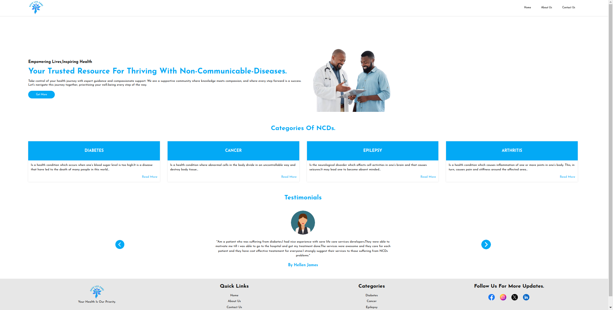
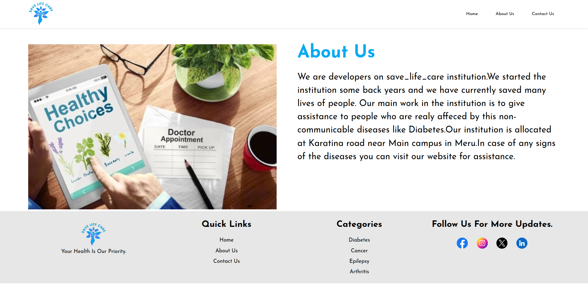
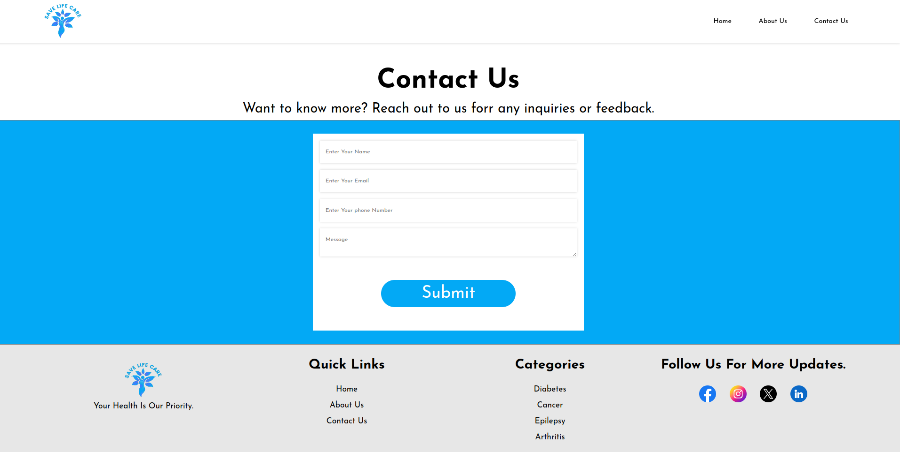
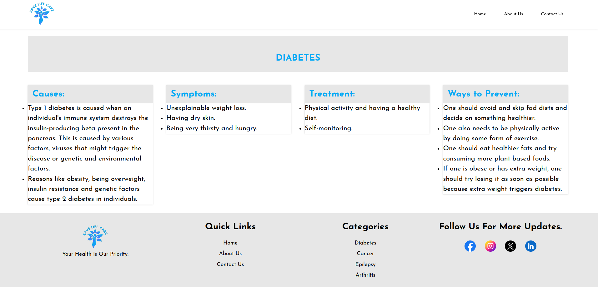

# Save Life Care

## Project description

Save Life care is a website for innovative health centre that patients can visit and be given more information about the treatment the hospital offers.
  
## Github Reposirory Link
 https://github.com/hellenjames/save-life-care

## Preview
Click this [link](https://hellenjames.github.io/save-life-care/) to see the live site.

## Project Screenshots
This is how the project looks like.
- Homepage

- About Us Page

- Contact us Page

## Diseases sample screenshort

- Disease page

## Technologies used
- HTML
- CSS(SASS)
  
## Project Setup and Installation 
1. Open the terminal and navigate to where you want to store the project e.g`cd Desktop`
2. To clone the project paste this in terminal `git clone https://github.com/hellenjames/save-life-care`
3. Use `cd Save-Life-Care` to get into the project directory
4. Open the project with your favourite web browser

## Contact Details
Contact me on **jameshellen2241@gmail.com** for any questions, reviews, or suggestions.

## License
MIT License

Copyright (c) 2024 by ***Hellen James***

Permission is hereby granted, free of charge, to any person obtaining a copy
of this software and associated documentation files (the "Software"), to deal
in the Software without restriction, including without limitation the rights
to use, copy, modify, merge, publish, distribute, sublicense, and/or sell
copies of the Software, and to permit persons to whom the Software is
furnished to do so, subject to the following conditions:

The above copyright notice and this permission notice shall be included in all
copies or substantial portions of the Software.

THE SOFTWARE IS PROVIDED "AS IS", WITHOUT WARRANTY OF ANY KIND, EXPRESS OR
IMPLIED, INCLUDING BUT NOT LIMITED TO THE WARRANTIES OF MERCHANTABILITY,
FITNESS FOR A PARTICULAR PURPOSE AND NONINFRINGEMENT. IN NO EVENT SHALL THE
AUTHORS OR COPYRIGHT HOLDERS BE LIABLE FOR ANY CLAIM, DAMAGES OR OTHER
LIABILITY, WHETHER IN AN ACTION OF CONTRACT, TORT OR OTHERWISE, ARISING FROM,
OUT OF OR IN CONNECTION WITH THE SOFTWARE OR THE USE OR OTHER DEALINGS IN THE
SOFTWARE.

